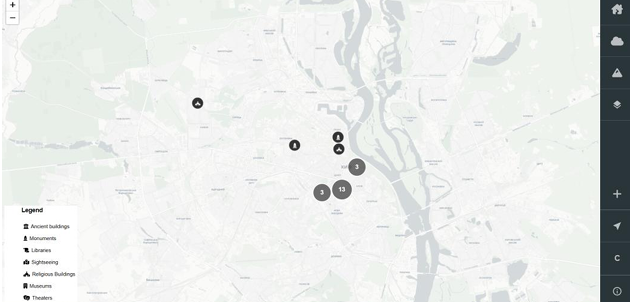

# **Cultural Heritage Site Monitoring in Conflict Areas: The Example of Ukraine**

---

## **Description**
The current web application provides users with a comprehensive view of cultural heritage sites in Kiev and how they are affected by the ongoing war in the area.

Key features include:
- Displaying these sites **before** and **during** the war in Ukraine.
- Highlighting any damage the sites have sustained.

The application is designed to be:
- **Expandable**: Easily applied to other conflict areas.
- **Decision-Oriented**: A tool for authorities responsible for cultural heritage conservation and monitoring.

  

---

## **System Requirements**
To use this application, ensure you have the following:

1. A modern web browser:
   - Chrome
   - Firefox
   - Safari
   - Edge
2. An active internet connection.
3. Command line/Terminal access for starting the application:
   - `npm start` (front/back end)
   - `node server.js`
4. **No installation required**: Simply navigate to the URL via your browser.

---

## **Creating an Account / Logging In (Optional)**
1. Click the **"Login"** button at the bottom-right corner.
2. Enter your credentials to log in. 
   - If you do not have an account, follow the prompts to create one.
3. Enjoy personalized interactions with the application.

---

## **Acknowledgments**
Special thanks to the following contributors:

- **Babis Chatzidiakos**  
  - Lead Programmer & Geoscience Expert, National Observatory of Athens  

- **Dr. Evangelos Gerasopoulos**  
  - Director, Institute for Environmental Research and Sustainable Development (ΙERSD) & leader of Urban Heritage Climate Observatory (UHCO), National Observatory of Athens  

- **Thanasis Koukoulis**  
  - Environmental Sciences Expert & Project Management, National Observatory of Athens  

- **Arezina Sakka**  
  - Expert on Cultural Heritage & member of Urban Heritage Climate Observatory (UHCO), National Observatory of Athens  

- **Kateryna Boichenko**  
  - Country Expert for Ukraine, Web2Learn  

- **Stefania Oikonomou**  
  - Communication and Outreach, Web2Learn  

- **Katerina Zourou**  
  - Co-founder, Space4CC  

---

## **License**
This project is licensed under the [CC BY 4.0 License](https://creativecommons.org/licenses/by/4.0/).
